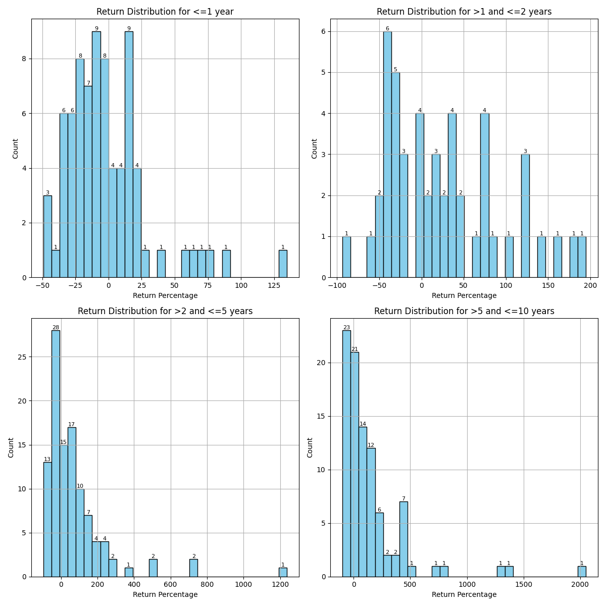
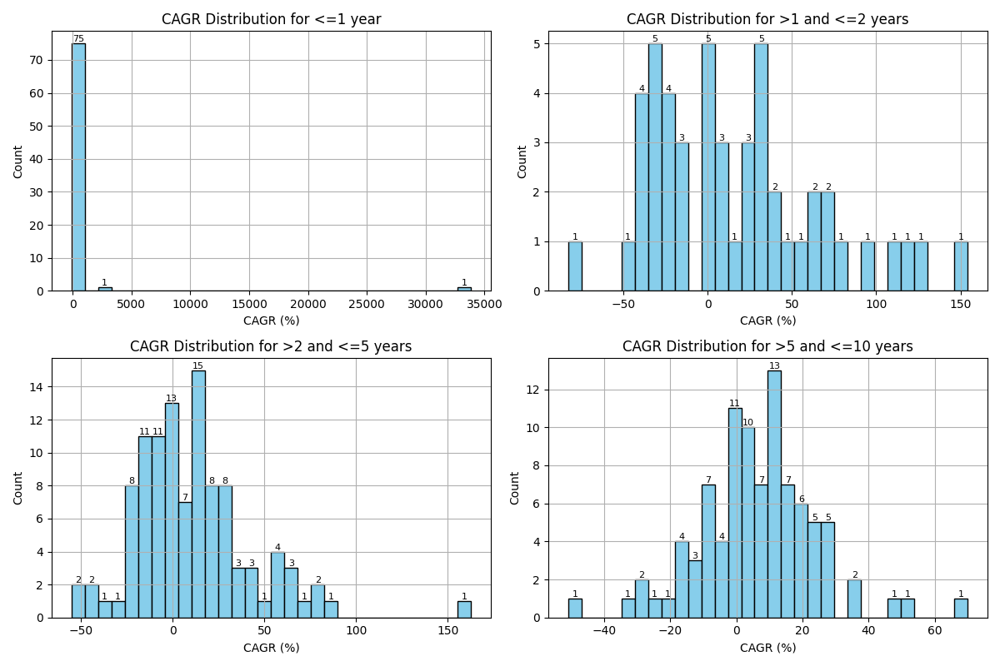

# Stock Performance Analysis
This report categorizes stocks by IPO age and displays those with a CAGR of >=20%.

## Return Distributions for different IPO ages

# Stock Performance Analysis
This report categorizes stocks by IPO age and displays those with a CAGR of >=20%.

## Combined CAGR Distribution

# Stock Performance Analysis
This report categorizes stocks by IPO age and displays those with a CAGR of >=20%.

## >0 and <= 1 years
Total Stocks in Category: 77
Success Rate (CAGR >= 20%): 28.57%

| Symbol               | Company Name                                         | CAGR (%) |
|----------------------|-----------------------------------------------------|----------|
| QUADFUTURE           | Quadrant Future Tek Limited                        | 33842.54 |
| SAGILITY             | Sagility India Limited                             | 3205.94 |
| BLACKBUCK            | Zinka Logistics Solutions Limited                  | 576.71 |
| KRN                  | KRN Heat Exchanger and Refrigeration Limited       | 446.22 |
| EIEL                 | Enviro Infra Engineers Limited                     | 235.09 |
| IGIL                 | International Gemmological Institute (India) Limited | 193.46 |
| EPACK                | EPACK Durable Limited                              | 137.60 |
| GARUDA               | Garuda Construction and Engineering Limited        | 115.57 |
| JGCHEM               | J G Chemicals Limited                              | 105.64 |
| AWFIS                | Awfis Space Solutions Limited                      | 105.39 |
| INTERARCH            | Interarch Building Products Limited                | 85.82 |
| BHARTIHEXA           | Bharti Hexacom Limited                             | 84.21 |
| PREMIERENE           | Premier Energies Limited                           | 55.89 |
| ABDL                 | Allied Blenders and Distillers Limited             | 46.60 |
| NIVABUPA             | Niva Bupa Health Insurance Company Limited         | 36.54 |
| SGLTL                | Standard Glass Lining Technology Limited           | 30.65 |
| DBEIL                | Deepak Builders & Engineers India Limited          | 29.76 |
| BANSALWIRE           | Bansal Wire Industries Limited                     | 25.61 |
| AADHARHFC            | Aadhar Housing Finance Limited                     | 24.95 |
| KRONOX               | Kronox Lab SciencesLimited                         | 23.88 |
| INDGN                | Indegene Limited                                   | 22.67 |
| TBOTEK               | TBO Tek Limited                                    | 20.15 |

---

## >1 and <= 2 years
Total Stocks in Category: 49
Success Rate (CAGR >= 20%): 44.90%

| Symbol               | Company Name                                         | CAGR (%) |
|----------------------|-----------------------------------------------------|----------|
| JYOTICNC             | Jyoti CNC Automation Limited                       | 154.17 |
| ZAGGLE               | Zaggle Prepaid Ocean Services Limited              | 124.00 |
| EMSLIMITED           | EMS Limited                                        | 116.21 |
| AZAD                 | Azad Engineering Limited                           | 111.92 |
| SIGNATURE            | Signatureglobal (India) Limited                    | 94.74 |
| INNOVACAP            | Innova Captab Limited                              | 77.63 |
| CONCORDBIO           | Concord Biotech Limited                            | 74.37 |
| SENCO                | Senco Gold Limited                                 | 69.04 |
| DOMS                 | DOMS Industries Limited                            | 62.49 |
| NETWEB               | Netweb Technologies India Limited                  | 60.31 |
| JSWINFRA             | JSW Infrastructure Limited                         | 52.43 |
| VPRPL                | Vishnu Prakash R Punglia Limited                   | 46.39 |
| MANKIND              | Mankind Pharma Limited                             | 39.19 |
| AVALON               | Avalon Technologies Limited                        | 36.72 |
| SURAJEST             | Suraj Estate Developers Limited                    | 34.88 |
| ASKAUTOLTD           | ASK Automotive Limited                             | 33.39 |
| AEROFLEX             | Aeroflex Industries Limited                        | 33.23 |
| BLUEJET              | Blue Jet Healthcare Limited                        | 32.16 |
| JLHL                 | Jupiter Life Line Hospitals Limited                | 29.31 |
| MEDIASSIST           | Medi Assist Healthcare Services Limited            | 22.85 |
| SAMHI                | SAMHI Hotels Limited                               | 22.39 |
| YATHARTH             | Yatharth Hospital and Trauma Care Services Limited | 21.24 |

---

## >2 and <= 3 years
Total Stocks in Category: 34
Success Rate (CAGR >= 20%): 35.29%

| Symbol               | Company Name                                         | CAGR (%) |
|----------------------|-----------------------------------------------------|----------|
| KAYNES               | Kaynes Technology India Limited                    | 162.62 |
| PRUDENT              | Prudent Corporate Advisory Services Limited        | 78.78 |
| KFINTECH             | KFin Technologies Limited                          | 75.32 |
| VENUSPIPES           | Venus Pipes and Tubes Limited                      | 67.09 |
| EMUDHRA              | eMudhra Limited                                    | 64.18 |
| INOXGREEN            | Inox Green Energy Services Limited                 | 56.70 |
| RAINBOW              | Rainbow Childrens Medicare Limited                 | 53.87 |
| ETHOSLTD             | ETHOS Limited                                      | 53.70 |
| MEDANTA              | Global Health Limited                              | 52.54 |
| PARADEEP             | Paradeep Phosphates Limited                        | 45.39 |
| BIKAJI               | Bikaji Foods International Limited                 | 42.30 |
| EMIL                 | Electronics Mart India Limited                     | 28.96 |

---

## >3 and <= 4 years
Total Stocks in Category: 57
Success Rate (CAGR >= 20%): 26.32%

| Symbol               | Company Name                                         | CAGR (%) |
|----------------------|-----------------------------------------------------|----------|
| ANANDRATHI           | Anand Rathi Wealth Limited                         | 80.23 |
| KALYANKJIL           | Kalyan Jewellers India Limited                     | 60.29 |
| DATAPATTNS           | Data Patterns (India) Limited                      | 39.45 |
| CRAFTSMAN            | Craftsman Automation Limited                       | 35.44 |
| METROBRAND           | Metro Brands Limited                               | 34.41 |
| RAILTEL              | RailTel Corporation of India Limited               | 34.27 |
| WINDLAS              | Windlas Biotech Limited                            | 28.74 |
| RATEGAIN             | RateGain Travel Technologies Limited               | 27.42 |
| TEGA                 | Tega Industries Limited                            | 26.95 |
| LODHA                | Macrotech Developers Limited                       | 25.65 |
| AMIORG               | Ami Organics Limited                               | 25.09 |
| SJS                  | S J S Enterprises Limited                          | 23.06 |
| SHYAMMETL            | Shyam Metalics and Energy Limited                  | 22.36 |
| CMSINFO              | CMS Info Systems Limited                           | 21.38 |
| SUPRIYA              | Supriya Lifescience Limited                        | 20.90 |

---

## >4 and <= 5 years
Total Stocks in Category: 15
Success Rate (CAGR >= 20%): 33.33%

| Symbol               | Company Name                                         | CAGR (%) |
|----------------------|-----------------------------------------------------|----------|
| MAZDOCK              | Mazagon Dock Shipbuilders Limited                  | 83.17 |
| ANGELBRKG            | Angel Broking Limited                              | 64.26 |
| CAMS                 | Computer Age Management Services Limited           | 28.34 |
| BECTORFOOD           | Mrs. Bectors Food Specialities Limited             | 25.16 |
| UTIAMC               | UTI Asset Management Company Limited               | 23.41 |

---

## >5 and <= 6 years
Total Stocks in Category: 12
Success Rate (CAGR >= 20%): 25.00%

| Symbol               | Company Name                                         | CAGR (%) |
|----------------------|-----------------------------------------------------|----------|
| RVNL                 | Rail Vikas Nigam Limited                           | 69.90 |
| POLYCAB              | Polycab India Limited                              | 46.38 |
| MSTCLTD              | MSTC Limited                                       | 33.71 |

---

## >6 and <= 7 years
Total Stocks in Category: 23
Success Rate (CAGR >= 20%): 26.09%

| Symbol               | Company Name                                         | CAGR (%) |
|----------------------|-----------------------------------------------------|----------|
| GRSE                 | Garden Reach Shipbuilders & Engineers Limited      | 53.59 |
| FINEORG              | Fine Organic Industries Limited                    | 28.92 |
| AMBER                | Amber Enterprises India Limited                    | 27.98 |
| HGINFRA              | H.G.Infra Engineering Limited                      | 24.88 |
| NEWGEN               | Newgen Software Technologies Limited               | 24.62 |
| MIDHANI              | Mishra Dhatu Nigam Limited                         | 20.50 |

---

## >7 and <= 8 years
Total Stocks in Category: 32
Success Rate (CAGR >= 20%): 12.50%

| Symbol               | Company Name                                         | CAGR (%) |
|----------------------|-----------------------------------------------------|----------|
| CDSL                 | Central Depository Services (India) Limited        | 25.95 |
| DIXON                | Dixon Technologies (India) Limited                 | 25.75 |
| DMART                | Avenue Supermarts Limited                          | 24.49 |
| BSE                  | BSE Limited                                        | 23.72 |

---

## >8 and <= 9 years
Total Stocks in Category: 24
Success Rate (CAGR >= 20%): 8.33%

| Symbol               | Company Name                                         | CAGR (%) |
|----------------------|-----------------------------------------------------|----------|
| LTI                  | Larsen & Toubro Infotech Limited                   | 28.76 |
| LTTS                 | L&T Technology Services Limited                    | 24.58 |

---

## >9 and <= 10 years
Total Stocks in Category: 2
Success Rate (CAGR >= 20%): 50.00%

| Symbol               | Company Name                                         | CAGR (%) |
|----------------------|-----------------------------------------------------|----------|
| ITI                  | ITI Limited FPO - Issue Withdrawn                  | 34.02 |

---

